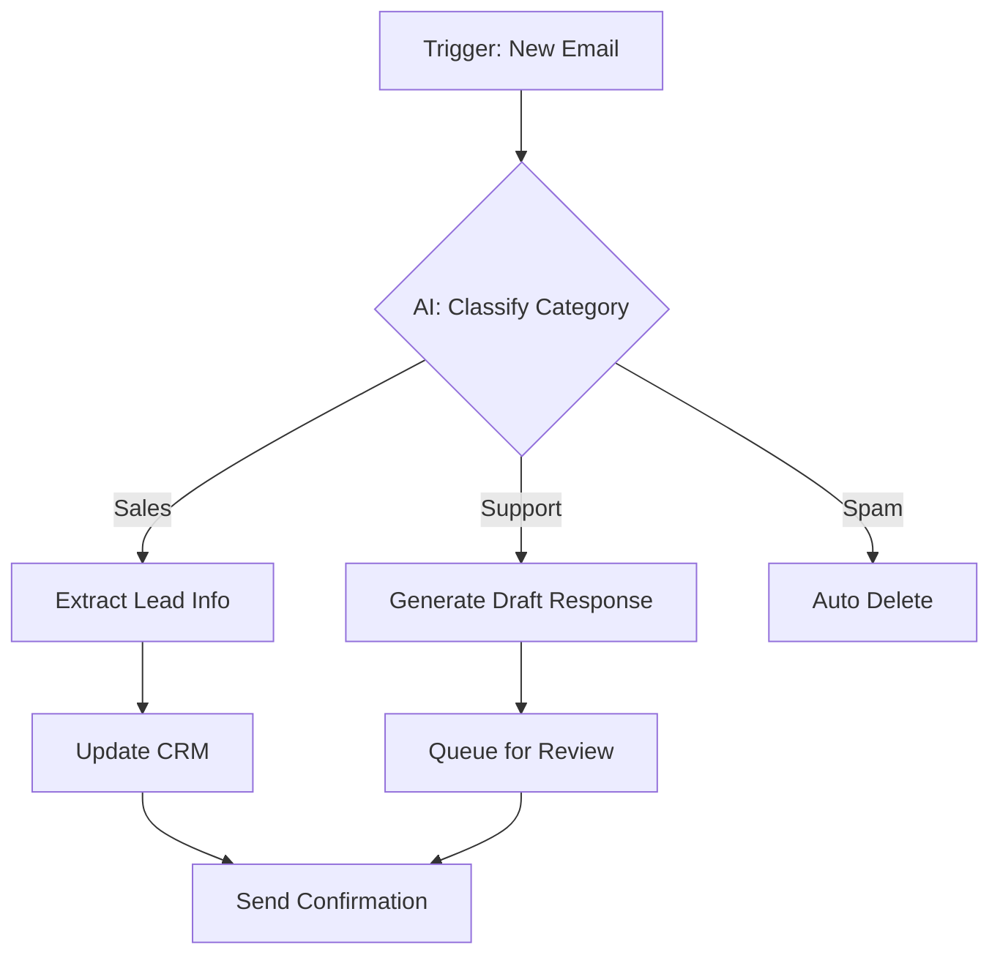

# AI Automation Workflows 2026: Complete Guide to Streamline Your Business

In 2026, businesses that leverage AI automation workflows are seeing **300% productivity gains** compared to traditional methods. This comprehensive guide shows you exactly how to build, implement, and scale AI-powered workflows that actually deliver results.

## What Are AI Automation Workflows?

AI automation workflows connect different tasks and processes using artificial intelligence to handle repetitive, time-consuming work automatically. Unlike traditional automation that follows rigid rules, AI workflows can understand context, make decisions, and adapt to changing conditions.

### The Business Impact

Studies show that companies implementing AI automation workflows experience:

- **78% reduction** in manual data entry
- **65% faster** project completion times
- **52% increase** in employee satisfaction
- **43% cost savings** on operational expenses

## Core Components of AI Automation Workflows

### 1. Trigger Systems

Every workflow starts with a trigger—the event that initiates the automation sequence:

**Triggers include:**
- New email arrivals
- Form submissions
- Scheduled times
- Database changes
- Webhook events
- Social media mentions

### 2. AI Processing Layer

This is where the magic happens. AI processes the input and determines appropriate actions:

- **Natural Language Processing**: Understanding and generating human text
- **Computer Vision**: Analyzing images and videos
- **Decision Logic**: Making context-aware choices
- **Pattern Recognition**: Identifying trends and anomalies

### 3. Action Execution

The final step executes the determined action:

- Sending emails or messages
- Updating databases
- Creating documents
- Scheduling appointments
- Posting to social media
- Generating reports

## Top AI Automation Tools for 2026

### No-Code Platforms

| Tool | Best For | Pricing | Difficulty |
|------|----------|---------|------------|
| **Make (Integromat)** | Complex workflows | $9-29/mo | Medium |
| **Zapier** | Simple integrations | $19-99/mo | Easy |
| **n8n** | Self-hosted | Free-$50/mo | Hard |
| **Airtable Automations** | Data workflows | $10-20/mo | Easy |
| **Bubble** | Custom apps | $29-119/mo | Hard |

### AI-Powered Automation Platforms

**Claude MCP (Model Context Protocol)**
- Connects AI to your data sources securely
- Supports file analysis, database queries, API calls
- Best for: Document processing and research workflows

**OpenAI Assistants API**
- Custom AI agents with tools and knowledge
- Persistent conversation context
- Best for: Customer support and internal tools

**Anthropic Workflows**
- Enterprise-grade AI automation
- Advanced safety and compliance
- Best for: Large organizations with strict requirements

## Building Your First AI Automation Workflow

### Step 1: Identify the Opportunity

Start by mapping your current processes:

1. **List daily tasks** that take more than 15 minutes
2. **Mark repetitive tasks** that follow patterns
3. **Calculate the time savings** if automated
4. **Prioritize high-frequency, low-complexity** tasks first

**Quick wins to target:**
- Email triaging and categorization
- Meeting note summarization
- Invoice processing
- Social media scheduling
- Lead qualification
- Report generation

### Step 2: Design the Workflow Flowchart

Create a visual map of your workflow:



### Step 3: Select and Configure Tools

Choose tools based on:
- **Integration capabilities** with existing systems
- **AI processing power** for your use case
- **Pricing model** aligned with volume
- **Learning curve** and available resources

### Step 4: Test and Iterate

Start with a small pilot:

1. **Test with sample data** only
2. **Measure accuracy** of AI decisions
3. **Adjust prompts** and parameters
4. **Gradually expand** to live data
5. **Monitor performance** continuously

## Practical AI Automation Workflows

### Workflow 1: Intelligent Email Management

**Problem:** Sales team spends 4 hours/day managing inbox

**Solution:**
```
Trigger: New email arrives
  ↓
AI: Analyze content and intent
  ↓
Decision Tree:
  - Hot lead → Add to CRM, notify sales rep
  - Info request → Send FAQ, add to nurture list
  - Spam → Delete automatically
  - Existing customer → Route to account manager
  ↓
Action: Execute and log response
```

**Results:** 70% reduction in email handling time, 40% faster response rates

### Workflow 2: Content Repurposing System

**Problem:** Marketing team creates 1 piece of content daily

**Solution:**
```
Trigger: New blog post published
  ↓
AI: Extract key points and quotes
  ↓
Generate variations:
  - Twitter thread (10 tweets)
  - LinkedIn post (3 variations)
  - Email newsletter snippet
  - Instagram caption
  ↓
Action: Draft and queue for review
```

**Results:** 5x content output from same effort

### Workflow 3: Automated Meeting Intelligence

**Problem:** Teams lose insights from meetings

**Solution:**
```
Trigger: Meeting ends
  ↓
AI: Transcribe and analyze recording
  ↓
Extract:
  - Key decisions
  - Action items with owners
  - Open questions
  - Timeline commitments
  ↓
Generate: Summary + Task list
  ↓
Distribute: To participants + project tools
```

**Results:** 90% action item completion, no more "what did we decide?"

### Workflow 4: Customer Support Triage

**Problem:** Support team overwhelmed by ticket volume

**Solution:**
```
Trigger: New support ticket
  ↓
AI: Classify urgency and category
  ↓
Route based on:
  - Simple FAQ → Auto-reply
  - Technical issue → Tier 2 support
  - Billing → Finance team
  - VIP customer → Priority queue
  ↓
Generate: Suggested response draft
```

**Results:** 60% first-contact resolution, 50% faster response times

## Advanced AI Workflow Patterns

### Multi-Agent Workflows

Complex workflows use multiple AI agents with specialized roles:

**Example: Market Research Workflow**

```
Research Agent (scans sources)
    ↓
Analysis Agent (extracts insights)
    ↓
Synthesis Agent (combines findings)
    ↓
Writing Agent (creates report)
    ↓
Review Agent (checks quality)
```

### Human-in-the-Loop Patterns

For critical decisions, keep humans involved:

- **Low confidence AI decisions** → Human review
- **High-value transactions** → Human approval
- **Ambiguous cases** → Human escalation
- **Compliance checks** → Human verification

### Self-Improving Workflows

Build feedback loops:

```
Execute workflow
    ↓
Measure outcomes
    ↓
Collect human corrections
    ↓
Retrain AI models
    ↓
Optimize workflow
```

## Measuring AI Workflow Success

### Key Metrics to Track

| Metric | What It Shows | Target |
|--------|---------------|--------|
| **Time Saved** | Efficiency gain | >50% |
| **Error Rate** | AI accuracy | <5% |
| **Cost Reduction** | Financial impact | >30% |
| **User Satisfaction** | Experience | >4/5 stars |
| **Adoption Rate** | Team buy-in | >80% |

### ROI Calculation

```
Time Savings = (Manual Time - Automated Time) × Frequency × Hourly Rate
Tool Cost = Platform fees + API costs + Maintenance
ROI = (Time Savings - Tool Cost) / Tool Cost × 100
```

**Example:**
- Manual email triage: 4 hours/day × $50/hr = $200/day
- Automated: 30 minutes/day × $50/hr = $25/day
- Daily savings: $175
- Monthly savings: $5,250
- Tool cost: $500/month
- Monthly ROI: 950%

## Common Pitfalls to Avoid

### 1. Over-Automating Too Soon

**Mistake:** Automating every process without validation

**Fix:** Start small, prove value, then expand

### 2. Ignoring Human Judgment

**Mistake:** Letting AI make all decisions

**Fix:** Keep humans in the loop for critical choices

### 3. Neglecting Maintenance

**Mistake:** Set it and forget it mentality

**Fix:** Regularly monitor and optimize workflows

### 4. Poor Data Quality

**Mistake:** Feeding bad data to AI systems

**Fix:** Establish data quality standards upfront

### 5. Lack of Training

**Mistake:** Assuming teams will adopt automatically

**Fix:** Provide training and show clear benefits

## The Future of AI Automation Workflows

### Trends for 2026-2027

**Autonomous Agents**
- AI agents that proactively identify and solve problems
- Less human intervention required
- Continuous learning and improvement

**Voice-First Automation**
- Voice-triggered workflows
- Natural conversation interfaces
- Mobile-first design

**Predictive Workflows**
- AI predicts needs before they arise
- Proactive task creation and assignment
- Anticipatory customer service

**Industry-Specific Templates**
- Pre-built workflows for common use cases
- Faster implementation
- Best practices baked in

## Getting Started Checklist

**Week 1: Planning**
- [ ] Document 3 potential automation opportunities
- [ ] Calculate potential time savings
- [ ] Choose your first workflow
- [ ] Select automation platform

**Week 2: Building**
- [ ] Map out workflow steps
- [ ] Configure triggers and AI processing
- [ ] Set up action integrations
- [ ] Test with sample data

**Week 3: Testing**
- [ ] Run pilot with real data
- [ ] Measure accuracy and performance
- [ ] Gather user feedback
- [ ] Refine prompts and logic

**Week 4: Launching**
- [ ] Train team on new workflow
- [ ] Deploy to production
- [ ] Monitor closely for 2 weeks
- [ ] Document results and learnings

## Conclusion

AI automation workflows are no longer a competitive advantage—they're table stakes for modern businesses. The companies that master these workflows today will dominate their markets tomorrow.

Start with one simple workflow, prove the value, and build from there. The ROI is real, the tools are accessible, and the time to act is now.

Your first automated workflow is just a few hours away. What will you build?
